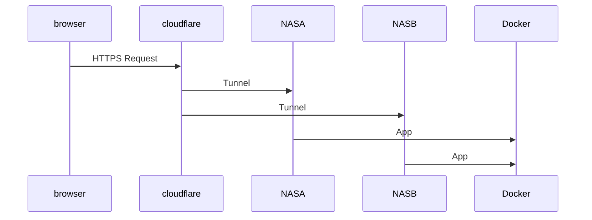

# infra-stacks

High-Availability Docker stacks for two Synology NAS systems. The stacks include Vaultwarden, Authentik, a placeholder SSO service and Cloudflare Tunnel. The ROLE variable allows running either as PRIMARY or BACKUP node.

## Quick Start
1. `git clone <repo>`
2. `cp .env.example .env`
3. Upload compose files via Portainer and deploy.

## Failover Testing
Stop `cloudflared` on the primary NAS and run `scripts/promote_backup.sh <primary-ip>` on the backup to switch roles.
